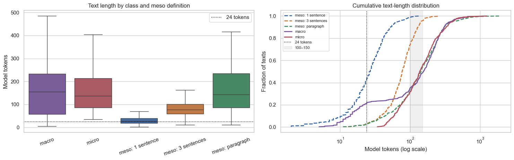
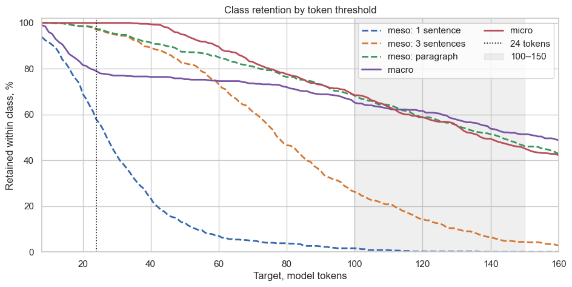

# Is semantic level of detail present in frozen embeddings?

## Introduction

Semantic Level of Detail (SLoD) describes whether a text span gives a paper-level overview (`macro`), a section-level account (`meso`), or a specific method or result (`micro`). I test whether a linear classifier can predict these weak labels from frozen sentence embeddings, whether it transfers from NLP to computer vision (CV), and how it behaves when texts are cut to the same length.

## Data and weak labels

I used one validation shard of `allenai/peS2o`, derived from S2ORC. The parser scanned 51,323 papers and assigned NLP or CV when exactly one domain keyword list matched the title. Titles, abstracts, first two introduction paragraphs and conclusion paragraphs are `macro`. The **full opening paragraph** of each other section is `meso`. Later paragraphs in methods, experiments, evaluation and results sections are `micro`. References, appendices and acknowledgements were excluded.

Structural sampling selected 250 spans per domain/class cell, capped at four spans per paper and label. The final experiment has **1,500 spans from 591 papers**: 500 each of macro, meso and micro, with 750 NLP and 750 CV spans. These are position-based weak labels, not human judgments of abstraction.

## Embeddings, probe and evaluation

I encoded the final texts with frozen `sentence-transformers/all-MiniLM-L6-v2` (384-dimensional normalized vectors; maximum input length 256 model tokens). The probe is logistic regression after standard scaling (`C=1`, no hyperparameter tuning). For in-domain evaluation, I ran five repetitions of paper-grouped 5-fold cross-validation using seeds 42–46. Each NLP paper is held out once per repetition, with no paper overlap between training and test. The cross-domain condition trains on all NLP spans and tests on all CV spans.

For the length control, I retained spans with at least 24 model tokens, truncated each to exactly 24, re-embedded them, and balanced classes separately in each training and test fold. This control retains 1,382 spans before fold-level balancing. I used 24 tokens because many titles and section leads cannot meet the assignment's suggested 100–150-token range. The control changes context and sample composition as well as length, so it cannot isolate a pure length effect.

I pooled the five held-out folds within each repetition, computed macro F1, and averaged the five scores. Intervals come from 2,000 bootstrap resamples of whole papers and are conditional on the selected corpus, fitted models and splits. Confusion matrices and per-class metrics pool held-out predictions; their counts are not independent samples.

## Results

| Condition | Accuracy | Macro F1 | 95% paper-bootstrap interval | Majority macro F1 | Evaluation size |
| --- | ---: | ---: | ---: | ---: | ---: |
| In-domain, repeated 5-fold | 0.519 | 0.519 | 0.492–0.545 | 0.305 | 348 papers; 750 unique spans |
| NLP → CV | 0.453 | 0.454 | 0.419–0.489 | 0.167 | 243 papers; 750 spans |
| Length-controlled, repeated 5-fold | 0.447 | 0.447 | 0.419–0.474 | 0.167 | 343 papers; 681 unique tested spans |

| Condition | Macro P / R | Meso P / R | Micro P / R |
| --- | ---: | ---: | ---: |
| In-domain | 0.679 / 0.676 | 0.407 / 0.402 | 0.471 / 0.479 |
| NLP → CV | 0.699 / 0.436 | 0.345 / 0.316 | 0.416 / 0.608 |
| Length-controlled | 0.541 / 0.528 | 0.370 / 0.377 | 0.433 / 0.434 |

The in-domain score exceeds its majority baseline but remains modest. Transfer to CV is weaker, particularly for `meso` recall (0.316). In the in-domain confusion matrix, 517 of 1,250 held-out true `meso` predictions are classified as `micro`; 482 of 1,250 true `micro` predictions are classified as `meso`. The full paragraphs frequently contain procedural details, making the section-level structural label hard to distinguish from method and result details.

## Length diagnostics

The plots below are from [test_length.ipynb](test_length.ipynb). They compare token lengths and retention thresholds for the selected `meso` text, with `macro` and `micro` as references. They are **length diagnostics**, not classifier scores. On all 500 `meso` examples, the median is 143 model tokens for the full paragraph. The 24-token threshold retains 487 of them. Axis labels and titles are in English.

## Error analysis and conclusion

The full predictions and confidence-ranked correct and failed examples are in `results/<condition>/`. The highest confusion is between `meso` and `micro`, consistent with opening paragraphs containing concrete technical content. Some `macro` spans also contain detailed procedures despite appearing in an abstract or introduction. These mismatches show why structural source alone is an imperfect proxy for semantic abstraction.

The results show that frozen MiniLM embeddings contain a linearly decodable signal for these structural labels, but the signal is not strong enough to treat the probe as a reliable SLoD labeler. I would use its probabilities only as an auxiliary retrieval feature, alongside relevance. A stronger test would use a paper-disjoint, human-rated abstraction set, plus controls for section vocabulary, numerals and citations.

## References

Lo, K. et al. (2020). S2ORC: The Semantic Scholar Open Research Corpus. *ACL 2020*. <https://doi.org/10.18653/v1/2020.acl-main.447>

Soldaini, L., & Lo, K. (2023). peS2o (Pretraining Efficiently on S2ORC) Dataset. <https://huggingface.co/datasets/allenai/peS2o>

Belinkov, Y. (2022). Probing Classifiers: Promises, Shortcomings, and Advances. *Computational Linguistics*, 48(1), 207–219. <https://doi.org/10.1162/coli_a_00422>
